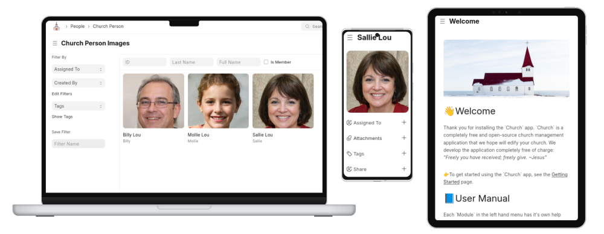

[](https://matrix.to/#/#the-church-app:matrix.org) [](https://github.com/meichthys/church?tab=readme-ov-file#-license-mit)   [](https://church.meichthys.com)

> [!WARNING]
> This app is not ready for production. Large changes should be expected until a 1.0.0 version is released.

# ⛪ Church

A fully open-source church management system built on the [Frappe Framework](https://frappe.io/framework).




## 🧪 Demo

If you would like to test out the current state of the application, you can try our Demo instance. Please keep in mind that this project is under active development and that there will likely be rough edges, bugs, and incomplete features. If you come across any of these, feel free to report them on our [issue tracker](https://github.com/meichthys/church/issues).

[](https://church.meichthys.com)

> When logging in, use the following credentials:
> ```
> Username: demo@demo.com
> Password: Matthew10:8b
> ```
> ⚠️ The demo instance is reset every Midnight (EST)

## ✨ Features

The following features have been implemented in this app (see the [🗺️ Roadmap](#-feature-roadmap) below for future plans):

- Built-in Documentation for each module
- Portal for users with a login:
  - Prayer request submission & viewing
- `Church Person` tracking
  - Define and track `Church Person Relation`ships
    - Define `Church Person Relation Type`s
  - Define & track `Church Person Role`s (i.e. board member, deacon, pastor, etc)
- `Church Family` tracking
  - Track head of household (Set on `Church Person` record)
- `Church Prayer Request` tracking
  - Authenticated or Anonymous web-form submissions
  - Authenticated users can manage their own prayer requests
- `Church Missionary` & `Church Missionary Agency` tracking
- Church module desk workspace with guided setup steps
- Event tracking
  - Event types, details, basic attendance tracking & reporting & templating
- Simple Task tracking
- Collection/donation tracking
  - Donation entry with collection totals & split check support
  - Bank reconciliation report
- Fund balance tracking
  - Collections automatically update funds when saved
- Basic Asset Tracking (location, details)
- Church Belief tracking
- Basic Church Website
  - About Page
- Church Letter tracking (from people & missionaries)
- Bible Vers & Reference entry
  - Fetch Bible text from bible-api.com
- Alms Requests

## 📥 Installing Frappe

To use the 'Church' app, you must have a working Frappe environment first. There are a variety of ways to install a Frappe instance. The recommended ways for this project are:

### ☁️ In the Cloud
The easiest (but not free) way to get a working Frappe environment is to use [Frappe Cloud](https://frappe.io/cloud). For a few dollars per month you can run an instance in the cloud. You get your choice of support options and shouldn't need to worry about data loss yourself.
Note: With this option, the money you pay to FrappeCloud is not received by maintainers of this 'Church' app. - We offer the 'Church' software for free, but you pay the cloud hosting costs to [Frappe](https://frappe.io/).

### 💪 Self-Host
If you're the more technical and/or frugal type, you can self-host an instance of the Church app on a home pc or server. [Frappe Manager](https://github.com/rtcamp/frappe-manager) can be used to quickly setup a local frappe instance. It's not as easy as a simple app install, but we think you can do it (Please ask us for help if you can't)! The general steps are:

1. Find a machine onto which you can install Frappe (A dedicated linux-based machine is best. Windows is possible, but is not recommended as it requires some extra steps and the use of [WSL](https://learn.microsoft.com/en-us/windows/wsl/install).)
2. Run the [frappe-manager install script](https://github.com/rtCamp/Frappe-Manager/tree/develop/scripts)
3. Create a new site using frappe-manager: `fm create -e prod <church.your_site.com>`.
4. Update DNS records to point to your new site. This is a bit outside the scope of this project, but basically you need to either update your hosts file to map your site url (used in the above command) to the ip address of the machine hosting the frappe instance. Alternatively, you can update your DNS server on your router to point to your new site. If you need help with this, you can file an issue and I'd be glad to schedule a call to try to help you set it up.

Making a local instance of frappe accessible from outside of your network is currently out of the scope of this project, but with some persistence and some technical expertise, it can be achieved. If you are completely lost or uncomfortable with this, it may be best to use the Frappe Cloud option above, or contact us for help. We'd be glad to help where we can.

## ⛪ Installing this Church app
To install this app on your frappe instance:

- If hosting on Frappe Cloud, you should be able to log into your Frappe Cloud dashboard, select your site, and install the app from the list of apps.
- If you are self-hosting, you can use bench by activating the [bench](https://github.com/frappe/bench) environment with `fm shell` and then running the following

  ```bash
  # Set the bench command to use your site (Replace `<church.your_site.com>` with your actual site name):
  bench use <church.your_site.com>

  # Download the app:
  bench get-app https://github.com/meichthys/church
  ## Or if you want to try the latest development version:
  bench get-app https://github.com/meichthys/church --branch develop

  # Install the app:
  bench install-app church

  # Migrate the app for good measure:
  bench migrate

  # In the future, to update the app to the latest version, log into the host server and run:
  fm shell
  bench update
  bench migrate
  ```

After the above installation you should be able to access the web interface using the URL you defined in the `bench create` command above. You should see the `Church` app installed when you view `Help > About`.

Before you start using the app be sure to:

1. Change the `Administrator` users's password (the default is `admin`). This user should only be used by the site administrator - and should not be used on a daily basis.
2. Setup a new user in the system by typing `New User` in the searchbar. Under the "Roles & Permissions" tab, Give this user the `Church Manager` Role Profile and `Church` Module Profile.
   This user will be able to manage all aspects of the church.
3. If you want more than one user on the system, or if you want to delegate some responsibilities to other people, you can create additional users with the `Church User` Role Profile and `Church` Module Profiles.
   These types of users will be able to read and update most information, but not certain critical information.
   - To see a list of permissions you can open the `Role Permissions Manager` and select the `Church Manager` or `Church User` roles to see what permissions these users roles have.

## 🗺️ Feature Roadmap

Hopefully this roadmap will help avoid too much scope creep and provide a sense of where this project is headed. The items below are listed in order of current priority.

- [Sermon Doctype](https://github.com/meichthys/church/issues/25)
- Ministry tracking
- [Add standard church website pages:](https://github.com/meichthys/church/issues/13)
  - [Home/Welcome](https://github.com/meichthys/church/issues/16)
  - [About](https://github.com/meichthys/church/issues/14)
  - [Missions](https://github.com/meichthys/church/issues/15)
  - Beliefs/Statement of Faith
  - Calendar
  - Contact Us
- Additional portal pages
  - Show tracked giving
  - Show tracked attendance
    - Allow updating attendance status(?)
- Add Onboarding Tours
  - Add 'Tutorial' button to each doctype form
  - [Email setup](https://github.com/meichthys/church/issues/32)

# 🆘 Support
If you need help setting up the app or configuring it, you can reach out in our [Matrix Chat](https://matrix.to/#/#the-church-app:matrix.org).

# 🤝 Contributing

Contributions are very welcome! If you plan any large contributions, please let me know first so we can coordinate and make the chances of a merged pull-request more likely.

- Doctype Naming: I've generally been using a single fieldname for the doctype names when the records in the doctype have low chance of clashing. If there is a higher chance of clashing, I've been using multiple fields in the name along with a `{#}` auto increment. The number of digits in the auto-increment are just sane values that should never be exceeded. I then specify the Title Field in the View Settings, and check the `Show Title in LInk Fields` option. This mostly hides the autonumber name from the user and lets the user only see the not-so-confusing name specified in the `Title Field` (sometimes I create a custom field to concatenate values - since the `Title Field` cannot take multiple fields at once afaik.)

## Steps for adding a new doctype:
  - Make sure the doctype name is pre-pended with `Church `
  - Add a doctype description on the settings tab
  - Add fields for the doctype (if necessary add field descriptions).
  - Add permissions to the doctype for `Church User` and `Church Admin` roles. (Not necessary for child tables)
  - Add the doctype to the relevant workspace. (not necessary for child tables)
  - If necessary, add an onboarding step & form tour to explain specific fields.
  - If any default records for this doctype should be shipped with the app, add fixtures for them in `hooks.py`.
  - If necessary, update this readme with the new functionality

# 🔑 License: MIT

>You can copy, translate, modify, and distribute this resource, without restriction, and without needing to ask permission. This resource is freely given (Matt 10:8) for the sake of the gospel.


