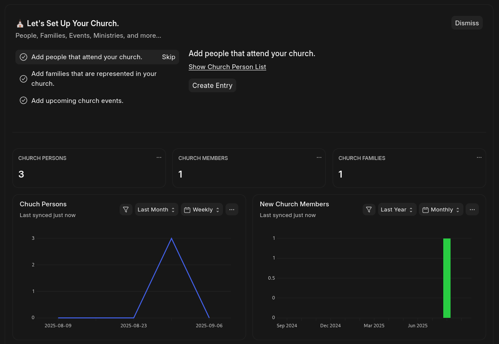

> [!WARNING]
> This app is not ready for production. Large changes should be expected until a 1.0.0 version is released.

# ⛪ Church

A fully open-source church management app built on the [Frappe Framework](https://frappe.io/framework).



## ✨ Features

The following features have been implemented in this app (see the [🗺️ Roadmap](#🗺️-roadmap) below for future plans):

- Portal for users with a login:
  - Prayer request submission & viewing
- `Church Person` tracking
  - Define and track `Church Person Relation`ships
    - Define `Church Person Relation Type`s
  - Define & track `Church Person Role`s (i.e. board member, deacon, pastor, etc)
- `Church Family` tracking
  - Track head of household (Set on `Church Person` record)
- `Church Prayer Request` tracking
  - Authenticated or Anonymous web-form submissions
  - Authenticated users can manage their own prayer requests
- Church module desk workspace with guided setup steps
- Event tracking
  - Event types, details, basic attendance tracking & reporting
- Collection/donation tracking
  - Donation entry with collection totals & split check support
  - Bank reconciliation report
- Church Belief tracking
- Basic Church Website
  - About Page

## 📥 Installing Frappe

To use this app, you must have a working Frappe environment. There are a variety of ways to install a Frappe instance. The recommended ways for this project are:

### ☁️ In the Cloud
The easiest (but not free) way to get a working Frappe environment is to use [Frappe Cloud](https://frappe.io/cloud). For a few dollars per month you can run an instance in the cloud. You get your choice of support options and shouldn't need to worry about data loss yourself.

### 💪 Self-Host
If you're the more technical or frugal type, you can self-host an instance on a home pc or server. [Frappe Manager](https://github.com/rtcamp/frappe-manager) can be used to quickly setup a local frappe instance. The general steps are:

1. Find a machine onto which you can install Frappe (A dedicated linux-based machine is best. Windows is not recommended as it requires the use of [WSL](https://learn.microsoft.com/en-us/windows/wsl/install).)
2. Run the [frappe-manager install script](https://github.com/rtCamp/Frappe-Manager/tree/develop/scripts)
3. Create a new site using frappe-manager: `fm create -e prod your_site.com`.
4. Update DNS records to point to your new site. This is a bit outside the scope of this project, but basically you need to either update your hosts file to map your site url (used in the above command) to the ip address of the machine hosting the frappe instance. Alternatively, you can update your DNS server on your router to point to your new site. If you need help with this, you can file an issue and I'd be glad to schedule a call to try to help you set it up.

Making a local instance of frappe accessible from outside of your network is currently out of the scope of this project, but with some persistence and some technical expertise, it can be achieved. If you are uncomfortable with this, it may be best to use the Frappe Cloud option above.

## ⛪ Installing this Church app
You can install this app using the [bench](https://github.com/frappe/bench) CLI:

If self-hosting, you can use bench by activating the bench environment with `fm shell`.

To install Church:
```bash
# First we need to download the app:
bench get-app https://github.com/meichthys/church
## Or if you want to try the latest development version:
bench get-app https://github.com/meichthys/church --branch develop

# Then we can install the app:
bench install-app church
```

After the above installation you should be able to access the web interface using the URL you defined in the `bench create` command above. You should see the `Church` app installed when you view `Help > About`.

Before you start using the app, it is a good idea to setup a new `User` in the system with the `Church Admin` Role Profile and `Church Admin` Module Profile. This user will be able to manage all aspects of the church (the `Administrator` user should be reserved for system wide maintenance or troubleshooting). Additionally, if you want to delegate some responsibilities to other people, you can create additional `User`s with the `Church User` Role Profile and `Church User` Module Profiles. Thise types of users will be able to read and update most information, but not critical information. To see a list of permissions you can open the `Role Permissions Manager` and select the `Church Admin` or `Church User` roles to see what permissions these users roles have.

## 🗺️ Feature Roadmap

Hopefully this roadmap will help avoid too much scope creep and provide a sense of where this project is headed. The items below are listed in order of current priority.

- Sermon Doctype
- Ministry tracking
- Fund Tracking
  - Update fund balance after collection submission
- Add standard church website pages:
  - Home/Welcome
  - Missions
  - Beliefs/Statement of Faith
  - Calendar
  - Contact Us
- Collection Improvements
  - Make collections submittable(?)
- Additional portal pages
  - Show tracked giving
  - Show tracked attendance
    - Allow updating attendance status(?)
- Event templating/recurrence
  - Templating via `Church Event Type` default values table(?)
- Add Onboarding Tours
  - Add 'Tutorial' button to each doctype form

# 🤝 Contributing

Contributions are very welcome! If you plan any large contributions, please let me know first so we can coordinate and make the chances of a merged pull-request more likely.

- Doctype Naming: I've generally been using a single fieldname for the doctype names when the records in the doctype have low chance of clashing. If there is a higher chance of clashing, I've been using multiple fields in the name along with a `{##}` auto increment. The number of digits in the auto-increment are just sane values that should never be exceeded. I then specify the Title Field in the View Settings, and check the `Show Title in LInk Fields` option. This mostly hides the autonumber name from the user and lets the user only see the not-so-confusing name specified in the `Title Field` (sometimes I create a custom field to concatenate values - since the `Title Field` cannot take multiple fields at once afaik.)

## Steps for adding a new doctype:
  - Make sure the doctype name is pre-pended with `Church `
  - Add a doctype description on the settings tab
  - Add fields for the doctype (if necessary add field descriptions).
  - Add permissions for the new doctype to the `Church User` and `Church Admin` roles.
    - After adding permisssions, export the permissions by going to the DocType and chosing ... > Customize > Action > Export Customizations. Select the `Church` module and check both the 'Sync on Migrate' and `Export Custom Permissions` options and lick 'Submit'.
  - Add the doctype to the relevant workspace.
  - If necessary, add an onboarding step & form tour to explain specific fields.
  - If any default records for this doctype should be shipped with the app, add fixtures for them in `hooks.py`.

## Pre-Commit

This app uses `pre-commit` for code formatting and linting. Please [install pre-commit](https://pre-commit.com/#installation) and enable it for this repository:

```bash
cd apps/church
pre-commit install
```

Pre-commit is configured to use the following tools for checking and formatting your code:

- ruff
- eslint
- prettier
- pyupgrade

# 🔑 License

MIT
